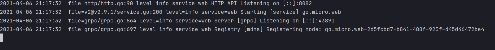
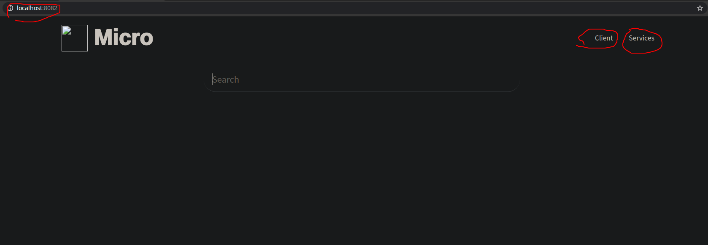
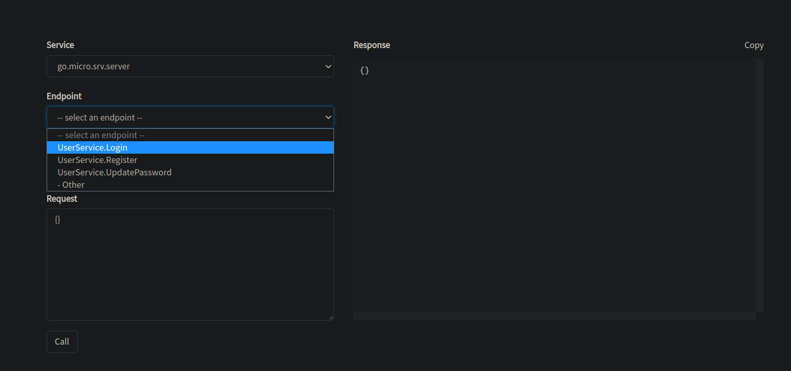

# go-micro-demo
这是我找的一个比较适合新手的一个go-micro的小项目，这个项目比较适合初学go-micro微服务的开发者。

学习这个项目，你需要掌握的是go-micro框架的使用和gorm框架的使用。

下载micro
```bigquery
go get github.com/micro/micro/v2 
```
另外就是使用gorm进行数据库的连接和数据的存储。


启动项目,首先我们要进入当前项目的demo/user目录下面，运行一下命令启动程序的服务端
```bigquery
go run main.go
```
然后我们可以运行client程序来启动客户端调用服务端的相关服务。
```bigquery
go run client.go
```
下面也有另一种方法

下载好micro之后，我们可以使用`micro web`来启动我们的web服务端进行相关服务的监听，这是程序会显示如下信息


这就表示我们的服务可以在`localhost:8082`上进行查看，你的浏览器可以访问这个网址查看当前的相关服务情况。


这样，我们就进行了一个UI界面，方便我们查看。


我们可以在client那里选择相关的服务进行调用。